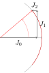

@def title = "Michele - Welcome"

This site is a random collection of personal stuff.

Are you looking for the smarter [M. Zaffalon](https://people.idsia.ch/~zaffalon/)?

# Random Notes

## Amplitude and Phase Modulation

~~~

  

    
    
Or how to tame the Bessel functions. A mostly <a href="https://mzaffalon.github.io/AM-PM/AM-PM.html">pictorial representation</a> of the sidebands of amplitude and phase modulated signals. This is adapted from a blog post written when I was an application scientist at <a href="https://www.zhinst.com/">Zurich Instruments</a>.

    

  

~~~

## University Classes

### 227-0689-00L System Identification HS2023
A class on system identification given by [Prof. Smith](https://people.ee.ethz.ch/~rsmith/) at ETH on standard and regularized least-squares, frequency- and time-domain methods, ARX-ARMAX systems, subspace and closed loop identification. The lecturer did not provide notes so a colleague and I wrote them: the [notes](https://github.com/mzaffalon/smith-system-identification-notes/blob/main/notes/notes.pdf) have not been reviewed and surely contain errors. We also make the solutions of the coding exercises available since they were not provided.

### 227-0216-00L Computational Control FS2023
A class on advanced control systems given by [Dr. Bolognani](https://www.bsaver.io/) at ETH that includes model predictive control, system identification, Markov decision processes and reinforcement learning. Since this class was given for the first time and the course notes were still missing, I wrote them: [notes](https://github.com/mzaffalon/bolognani-computational-control-notes/blob/main/notes.pdf) have been only partially reviewed and surely contain errors.

## 227-0103-00L Control Systems HS2022
An introductory class to control systems (my first) given by [Prof. Dörfler](http://people.ee.ethz.ch/~floriand/) at ETH. The course material focuses only on linear systems: stability, PID and their tuning, controller design via "loop shaping", LQ Regulator, optimal state estimation.

I appreciated how Dörfler stayed after class to answer students' questions.

I also had the pleasure to work with a [talented young engineer](https://ikaftan.github.io/).

## Control Systems Lab: Helicopter on a Stick

While taking Dörfler's class, a colleague and I did a lab where we controlled an helicopter on a stick: this lowers the number of degrees of freedom from 6 to two. Here is the [report](https://gitlab.com/mzaffalon/IfA-lab_helikopter-II/-/blob/main/report/main.pdf). We had a few interesting revelations in the process.
